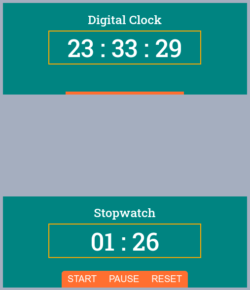

# Todo App
<p> A demo stop watch with a digital clock</p>

<br>



## How to run 
1. Clone the repository

    ```sh
    git clone https://github.com/saiful-70/stop-watch.git
    ```

2. Double click of __index.html__ to see output

## User guide
1. Click __START__ button to start the stopwatch
2. Click __PAUSE__ button to pause the stopwatch and then after clicking the __START__ button to start the watch from last idle time.
3. And reset button will reset the stopwatch to beginning of the time means zero zero(00 : 00).
